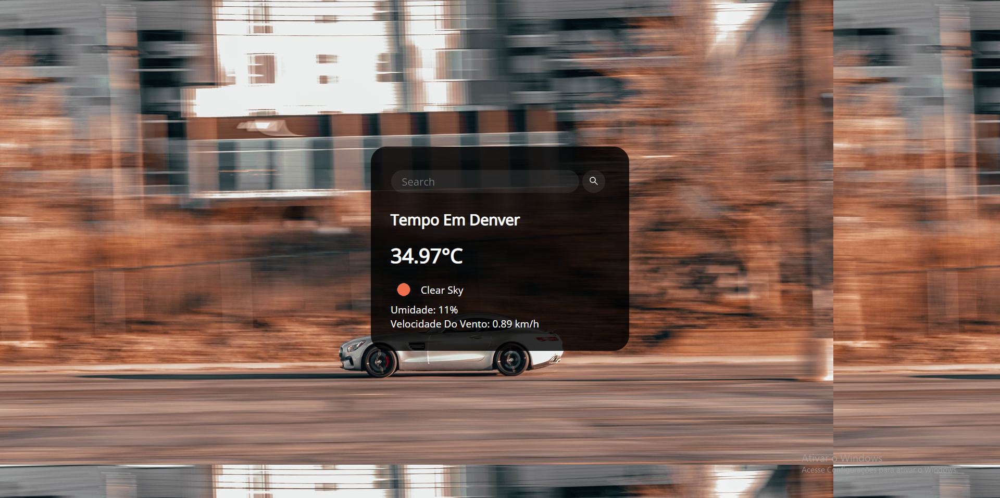

## App Climático 

### Um site que permite você pesquisar qualquer local do munodo e ver o clima dele em tempo real, seja a temperatura, umidade,valocidade do vento e cor do céu

## Algumas Telas Da Aplicação

## 🚀Tecnologias Usadas

### esse projeto foi feito consumindo uma api do openweathermap e utilzei as seguintes linguagens:

 

## Como Usar 😀
### Para usar basta baixar o arquivo aqui pelo github mesmo,acessar o script.js e colocar sua api secreta do openweathermap em apikey e estará pronto para uso!

## Importante 💛

### a aplicação foi totalmente feita por mim joão ricardo mas você pode usar ela do jeito que preferir! seja para estudo,apoio nos estudos ou até para ganhar dinheiro quem sabe rsrs. entre em contato em joaobarbanti7@gmail.com.
